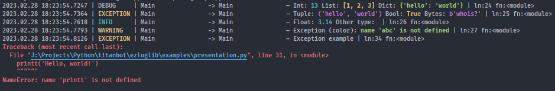

.. _index:

===================
ezlog documentation
===================

**Modern, simple in use, colored logging library for python.**

* Formatting support
* Stdout\Stderr\File handlers
* Easy to use & add custom handlers
* Colored and customizable

Quick start
-----------

Just install this library via command:

.. code-block:: shell

    pip install ezloglib

Create new file and write to it a code bottom. Result of this example you can
see on the image on top.

.. code-block:: python

    import ezlog
    import math

    # declare stdout handler with log level - debug
    sout_handler = ezlog.StdoutHandler(log_level='debug')

    # initialize main logger
    main_logger = ezlog.Logger('Main', handlers=[sout_handler])

    # examples of the default log levels
    main_logger.debug('This is {} message', 'debug')
    main_logger.exception('This is {} message', 'exception')
    main_logger.info('This is {} message', 'info')
    main_logger.warning('This is {} message', 'warning')
    main_logger.error('This is {} message', 'error')
    main_logger.critical('This is critical message')

    # pretty formatting + colored types
    main_logger.debug('Int: {} List: {} Dict: {}', 13, [1, 2, 3], {'hello': 'world'})
    main_logger.exception('Tuple: {} Bool: {} Bytes: {}', ('hello', 'world'), True, b'whois?')
    main_logger.info('Float: {}', math.pi)
    main_logger.warning('Exception (color): {}', NameError("name 'abc' is not defined"))

    # example of the formatting
    main_logger.info('{:<20}--{:>19}', 'pi is', f'{math.pi:.2f}')

    # example exception logging
    try:
        printt('Hello, world!')
    except Exception as e:
        # NOTE: You can use also debug, critical and other log levels to print exception
        main_logger.exception('Exception example', exception=e)

    main_logger.info('It is continue work')

.. toctree::
    :hidden:
    :caption: Quick Guide

    quickguide/firststeps
    quickguide/parent_groups

.. toctree::
    :hidden:
    :caption: Reference

    reference/ezlog_module
